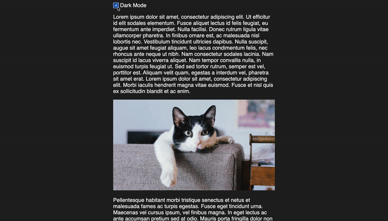

# Dark Mode Transitions

Just a quick showcase of how you can use the (very experimental) page-transitions api to toggle a sites theme.

> Note: :warning: This example is for an outdated version of the view-transitions-api and no longer works

The code for this demo was largeley inspired by [this demo](https://developer.chrome.com/blog/shared-element-transitions-for-spas/#how-these-transitions-work) for the page transitions api. I then adapted it to do theme changes.
